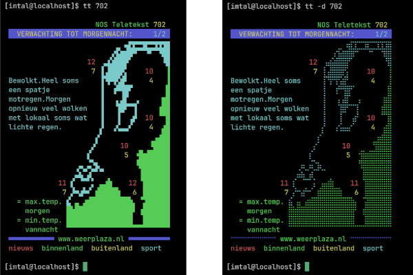

# tt - a teletext viewer

## Introduction

As I work more with the terminal I wanted to check the news once in a while without grabbing my phone. This is a command line viewer for the Dutch [NOS teletekst](https://teletekst-data.nos.nl/webplus). It can be used in a command line mode where each command shows the page asked for. Alternatively it has an interactive mode where typing three numbers moves you to another page.

## Usage

Use this program within your favorite terminal screen, if you omit the page number it defaults to 100 or whatever specified in the config file (see below):

	$ tt 200

See `-h` or `--help` for the use of the application:

	usage: tt [-v] [-h] [-i] [-r] [-b] [-d] [PAGE]
	
	Teletext viewer (Dutch NOS pages)
	
	positional arguments:
	  PAGE                  page to view
	
	options:
	  -v, --version         show version and exit
	  -h, --help            show this help message and exit
	  -i, --interactive     interactive mode (full screen)
	  -r [N], --reload [N]  reload page every N seconds in interactive mode
      -b, --block           use ANSI block characters instead of legacy blockchar
      -d, --dot             use braille characters instead of legacy blockchar

Your default options use a config file `~/.config/tt.ini`:

    [defaults]
    page = 101
    #mode = block
    #mode = dot
    mode = legacy
    #interactive = true
    #reload = 5

In interactive mode the following keys can be used:

* `q` - quit
* `0`-`9` - go to page (enter an number between 100 and 999)
* `r`|`c`|`y`|`g` - the red, cyan, yellow and green buttons
* down|up - previous or next subpage

## Screenshot

Below two screenshots, left the default legacy character support in a [WezTerm](wezfurlong.com) terminal, right using the `dot` option:

## Dependencies

Not many terminal fonts have the legacy (teletext) 2x3 block characters available (Unicode range 1FB00-1FBFF, [Symbols for Legacy Computing Supplement](https://www.unicode.org/charts/PDF/U1CC00.pdf)). In [WezTerm](wezfurlong.org) you can use the `anti_alias_custom_block_glyphs = true` setting so Wezterm self renders the block glyphs an does not depend on the fonts supporting it.

When using a font that does not support the legacy block characters the `-b` (`--block`) or `-d` (`--dot`) option can be used. The `block` option uses the broader supported 2x2 block characters (Unicode range: 2580–259F, [Block Elements](https://www.unicode.org/charts/PDF/U2580.pdf)) while the `dot` option uses the 2x4 braille dots (Unicode range 2800–28FF, [Braille Patterns](https://www.unicode.org/charts/PDF/U2800.pdf)). 

To check whether the fonts on the system support the given area block you can use the following commands:

    $ fc-match -s monospace
    $ fc-match --format='%{charset}\n' OpenSans

If there is not a specific font available (I am still waiting for [NerdFonts](https://www.nerdfonts.com/) support, see issue [#1301](https://github.com/ryanoasis/nerd-fonts/issues/1301)) then install it from the following repo:

    $ wget https://github.com/dokutan/legacy_computing-font/archive/refs/heads/master.zip
    $ unzip legacy_computing-font-master.zip
    $ cd legacy_computing-font-master
    $ fontforge -c 'Open($1); Generate($2)' LegacyComputing.sfd LegacyComputing.otf
    $ cp LegacyComputing.otf ~/.local/share/fonts/.
    $ fc-match --format='%{charset}\n' LegacyComputing
    1fb00-1fb92 1fb94-1fbca 1fbf0-1fbf9

Now `xterm` uses that font automatically as fallback although the glyphs leave spaces between them.

## Installation

Just copy the script to your `~/.local/bin` directory or `/usr/bin` for a system-wide installation. Please note this is just a script, not an 'application'. The intention was always to keep it as a self contained script as short as possible (not more than 400 LOC, most lines in character mapping). See the import statements for the libraries needed.
